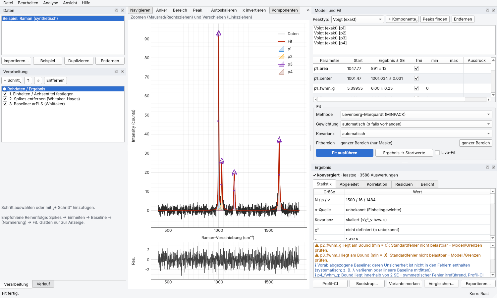

# EZSpec

Interaktive Spektrenauswertung und Kurvenanpassung mit ehrlicher Fit-Statistik.
Rust-Kern für die Numerik, Python (lmfit/SciPy) als statistische Referenz,
Qt-Oberfläche (PySide6 + pyqtgraph), Publikationsfiguren mit matplotlib.



## Was EZSpec anders macht als Origin/SciDAVis

| Thema | EZSpec |
|---|---|
| Verarbeitung | Nicht-destruktive, versionierte Pipeline. Rohdaten bleiben unverändert, jeder Schritt ist eine skriptbare Operation mit JSON-Parametern, alles ist rückgängig machbar. |
| Baselines | Ankerpunkte im Plot (Median-Fenster/„Snap“, PCHIP/Akima/kubisch/linear), AsLS und arPLS mit gezeichneten Ausschluss- und Pflichtbereichen, SNIP, Rubberband, Polynom (auch modpoly/imodpoly). Live-Vorschau mit korrigiertem Spektrum. Baselines werden als Rezept gespeichert, nicht als Array. |
| Fit-Statistik | Die σ-Quelle ist Pflichtangabe. χ² gibt es nur bei bekanntem σ, mit Erwartungsband 1 ± √(2/ν). Die Kovarianz ist bei bekanntem σ absolut; Skalieren mit √χ²_ν ist möglich, wird aber markiert. R² ist als deskriptiv gekennzeichnet. AIC/AICc/BIC werden in der zur σ-Quelle passenden Form berechnet. |
| Diagnostik | Parameter am Bound, \|ρ\| > 0,9, Kondition der Jacobi-Matrix, Runs-Test, Lag-1-Autokorrelation, Normalitätsmaße, QQ-Plot. Warnungen bei Fits auf geglätteten, interpolierten oder normierten Daten und bei Neyman-Gewichtung σ = √y. |
| Unsicherheiten | Volle Fehlerfortpflanzung für abgeleitete Größen (Höhe, exakte Voigt-FWHM, Fläche, Flächenanteile). Dazu Profil-Likelihood-CIs, Residuen- und Wild-Bootstrap, MCMC-Posterior (emcee, optional) sowie systematische Baseline-Unsicherheit über λ-Variation. |
| Modelle | Flächennormierte Peaks (Gauß, Lorentz, exakter Voigt, Pseudo-Voigt, TCH, Pearson VII, EMG), linear mitfittbare Untergründe, klassische Funktionen und eigene Formeln mit beliebig vielen Parametern und unabhängigen Variablen. Constraints wie `p2_fwhm = p1_fwhm`. |
| Serien | Serienfits mit Startwert-Weitergabe, globale Fits mit geteilten Parametern, Parameter-vs-Index-Plot. |
| Reproduzierbarkeit | Einzeldatei-Projekt (Zip) mit bytegenauen Rohdaten. Skript-Export reproduziert Pipeline, Fit und Figur bitgenau aus den Rohdaten, geprüft per SHA-256. |
| Figuren | Deklarative Figure-Spec (JSON) und matplotlib-Renderer mit Journal-Vorlagen in mm/pt, Vorschau in physischer Größe, 2. x-Achse (nm ↔ eV ↔ cm⁻¹), Parameterbox, Petroff-Farbzyklus, editierbarer Text im PDF. |

## Installation

Voraussetzungen: Python ≥ 3.10 und eine Rust-Toolchain (`rustup`) für den Quell-Build.

```bash
python -m venv .venv && source .venv/bin/activate
pip install -e ".[gui,test]"      # baut die Rust-Erweiterung ezspec._core via maturin
ezspec                            # startet die GUI (alternativ: python -m ezspec)
```

Ohne kompilierten Kern läuft alles mit der NumPy/SciPy-Referenzimplementierung
(`EZSPEC_BACKEND=python` erzwingt das). Unter Linux ohne Desktop braucht Qt
`libegl1 libxkbcommon-x11-0 libdbus-1-3 libfontconfig1`.

## Bedienung (GUI)

1. **Daten**: *Importieren…* (Text/CSV mit automatischer Erkennung von Trennzeichen und Dezimalkomma,
   mehrere y-Spalten, optional σ-Spalte und weitere unabhängige Variablen; JCAMP-DX inkl.
   ASDF-Kompression) oder *Beispiel*. Dateien lassen sich auch ins Fenster ziehen.
2. **Verarbeitung**: *+ Schritt* (Bereich, Spikes, Baseline, Glätten, Unsicherheit, Skalierung,
   Einheiten). Ein gewählter Schritt zeigt seinen Eingang und das Ergebnis; Parameter ändern sich live.
   Plot-Werkzeuge (Tasten 1–4): **Anker** (Klick setzt einen Anker, der auf den Daten einrastet;
   Shift setzt ihn frei; Ziehen verschiebt; Rechtsklick löscht), **Bereich** (Masken, Pflichtbereiche,
   Rauschbereich, Fitbereich).
3. **Modell und Fit**: Werkzeug **Peak** (Klick fügt einen Peak des gewählten Typs ein; der obere
   Marker setzt Lage und Höhe, der seitliche die Breite), *Peaks finden*, *+ Komponente* (Untergrund,
   klassische Funktion, eigene Formel). In der Tabelle stehen Startwert, Grenzen, „frei“, Ausdruck und
   Ergebnis. *Fit ausführen* mit Strg+R; *Live-Fit* fittet nach jeder Änderung neu.
4. **Ergebnis**: Statistik mit Erklärungen (Tooltips), Warnungen, abgeleitete Größen, Korrelationsmatrix,
   Residuendiagnose, Textbericht. Dazu *Profil-CI*, *Bootstrap*, Baseline-Systematik, Varianten merken
   und vergleichen (ΔAICc, Akaike-Gewichte).
5. **Export**: *Datei → Exportieren*: Abbildung (Editor mit Journal-Vorlagen), Ergebnistabellen
   (CSV/JSON/Bericht), Python-Skript. *Analyse → Serie / globaler Fit* (Strg+G).

## Skript-API

```python
from ezspec import Model, add_peak, ops
from ezspec.io import read_file
from ezspec.fit import FitOptions, fit, profile_ci

s = read_file("spektrum.csv")                         # Spectrum (x, y, σ, Einheiten, …)
s = ops.despike(s)
s = ops.baseline_arpls(s, lam=1e7, exclude_ranges=[[990, 1010]])
s = ops.estimate_noise(s, method="region", region=[1700, 1800])   # σ-Quelle: geschätzt

m = Model()
add_peak(m, "voigt", center=1001, height=90, fwhm=8)
add_peak(m, "lorentzian", center=1032, height=25, fwhm=9)
m.component("p2_").settings["center"].expr = "p1_center + 31"   # Constraint (fester Abstand)
m.add("formula", options={"expression": "a + b*x"})  # eigene Formel, beliebig viele Parameter

r = fit(s, m, FitOptions(x_range=[950, 1100]))
print(r.report())                                     # Parameter, abgeleitete Größen, Güte, Diagnostik, Hinweise
r.value("p1_center"), r.stderr("p1_center"), r.stats.redchi, r.derived_table()
profile_ci(r)                                         # asymmetrische Konfidenzintervalle
```

Weitere Einstiegspunkte: `ezspec.Pipeline` (Schritte, Serialisierung, Caching),
`ezspec.fit.fit_series`, `ezspec.fit.fit_global`, `ezspec.fit.compare`,
`ezspec.fit.baseline_systematics`, `ezspec.fit.simulate_nested_test`, `ezspec.fit.mcmc`,
`ezspec.project.Project`,
`ezspec.export.figure` und `ezspec.export.script.generate_script`.

## Statistik-Semantik im Detail

* **σ bekannt** (Spalte, DER_SNR- oder Bereichsschätzung, Konstante, Poisson-Modell):
  χ² = Σ((y − f)/σ)², χ²_ν = χ²/ν mit ν = N − p (p = freie Parameter nach Constraints).
  Gezeigt wird das 1σ-Band 1 ± √(2/ν). Eine Warnung erscheint außerhalb von ±3√(2/ν).
  Kovarianz C = (JᵀJ)⁻¹ (absolut). AIC = χ² + 2K, BIC = χ² + K ln N mit K = p.
* **σ unbekannt**: kein χ². Gezeigt werden RSS, s = √(RSS/ν) und RMSE; die Kovarianz wird mit s² skaliert.
  AIC = N ln(RSS/N) + 2K mit K = p + 1, weil σ herausprofiliert wird (Burnham & Anderson).
  lmfit verwendet K = p; AIC-Differenzen sind gleich, AICc unterscheidet sich.
* **Poisson (σ² = Modell)**: Die iterativ umgewichtete Kleinste-Quadrate-Lösung ist der
  Poisson-Maximum-Likelihood-Schätzer (getestet). Für die Informationskriterien gilt −2 ln L = 2Σ(f − y ln f).
* **Modellvergleich** nur bei identischen Daten, gleichem Bereich und gleicher Gewichtung; sonst wird er
  verweigert. Gezeigt werden ΔAICc/ΔBIC und Akaike-Gewichte. „Ein Peak mehr“ wird nicht per F-Test
  entschieden (Randproblem, Protassov et al. 2002), sondern über einen simulationskalibrierten
  Likelihood-Quotienten-Test (parametrischer Bootstrap unter dem Nullmodell; `simulate_nested_test`).
* **Poisson-Gewichtung**: Zusätzlich zum Pearson-χ² wird die Poisson-Devianz berichtet.
* **Numerik**: lmfit/MINPACK findet das Minimum. Danach folgt eine Gauß-Newton-Nachverfeinerung mit
  Richardson-extrapolierter Jacobi-Matrix, und die Kovarianz wird per SVD aus dieser Matrix berechnet
  (mit Rang- und Konditionsprüfung).

## Validierung (alle Teil der Testsuite)

* **NIST StRD (nichtlineare Regression)**: Alle 27 Probleme laufen über den vollständigen Pfad
  Formelparser → Modell → Engine. Erreicht werden ≥ 7 signifikante Stellen in allen zertifizierten
  Parametern, ≥ 9 in der RSS und ≥ 6 in den Standardabweichungen. Ausnahme ist Lanczos1, dessen
  zertifizierte RSS von 1,4·10⁻²⁵ reines Rundungsrauschen ist; dort werden nur die Werte geprüft.
* **Baselines**: Der Rust-Kern und die Python-Referenz reproduzieren pybaselines 1.2.1. AsLS, arPLS und
  SNIP (Filterordnungen 2/4/6/8, steigende und fallende Fenster) stimmen auf ~10⁻⁸ überein,
  modpoly/imodpoly auf 10⁻¹⁰.
* **Lineshapes**: Voigt = `scipy.special.voigt_profile` (10⁻¹²). Flächennormierung und FWHM-Definition
  sind geprüft. Die Olivero-Longbothum-Näherung ist auf 0,025 % genau. TCH weicht numerisch gemessen um
  ≤ 0,45 % in der Breite und ≤ 1,3 % der Peakhöhe vom Voigt ab.
* **Rust ≙ Python**: Alle Kernfunktionen stimmen auf zufälligen Eingaben überein. Die komplette Suite
  läuft zusätzlich ohne Rust-Kern.
* **Ehrlichkeit der Fehlerbalken**: In einer Monte-Carlo-Studie (300 Wiederholungen) überdecken die
  68,3-%-Intervalle den wahren Wert im erwarteten Anteil, und ⟨χ²_ν⟩ ≈ 1. Profil-CI = lineare SE für
  lineare Modelle; die Bootstrap-SD entspricht der skalierten SE; die MCMC-68-%-Intervalle stimmen
  bei gut bestimmten Fits mit der linearen SE überein. Der Simulationstest erzeugt keinen
  Phantom-Peak und weist echte Peaks nach.
* **Import**: JCAMP-DX wurde mit dem Paket `jcamp` auf 105 Beispieldateien abgeglichen. Dazu kommen
  Rundreise-Tests für AFFN/SQZ/DIF/DUP mit Y-Prüfwerten.
* **Reproduzierbarkeit**: Das exportierte Skript liefert in einem separaten Prozess bitgleiche Parameter
  und eine byteidentische SVG-Figur. Manipulierte Rohdaten werden abgewiesen.

```bash
cargo test -p ezspec-core                      # 25 Rust-Tests
QT_QPA_PLATFORM=offscreen pytest -q            # Python-, Statistik-, I/O-, Export- und GUI-Tests
EZSPEC_BACKEND=python pytest -q                # dasselbe ohne Rust-Kern
```

## Architektur

```
crates/ezspec-core   Rust, GUI-unabhängig: Lineshapes (Faddeeva), gebänderter Whittaker-Löser
                     (AsLS/arPLS, Masken), SNIP, Rubberband, PCHIP/Spline, gleitender Mittelwert,
                     DER_SNR, Min/Max-Dezimierung
crates/ezspec-py     PyO3-Bindings → ezspec._core (abi3-Wheel ab Python 3.10, GIL-Freigabe)
python/ezspec        spectrum.py (Datentyp mit σ-Quelle), ops/ (versionierte Operationen),
                     pipeline.py, models/ (Komponenten, sicherer Formelparser, Bibliothek),
                     fit/ (Engine, Statistik, Profil-CI, Bootstrap, Vergleich, Serien/Global,
                     Baseline-Systematik), io/ (Text, JCAMP-DX), project.py, export/ (Figur,
                     Tabellen, Skript), gui/ (Qt), _reference.py (NumPy/SciPy-Referenz)
tests/               NIST-StRD-Daten (gemeinfrei) und Testsuite
```

Die Arbeitsteilung: lmfit/SciPy definiert, was korrekt ist; der Rust-Kern muss
das in den Paritätstests reproduzieren und macht die interaktiven Pfade schnell
(Baseline-Slider, Modellvorschau beim Ziehen).

## Grenzen und offene Punkte

* Die Rust-LM-Innenschleife für Live-Fits großer Modelle und parallele Batches ist noch nicht
  umgesetzt; die Fits laufen über lmfit.
* Hersteller-Formate (OPUS, WiRE, OMNIC, SPC) und JCAMP-NTUPLES (z. B. NMR-FIDs) fehlen noch.
* Noch nicht implementiert: Bayes-Evidenz (dynesty), Instrumentfunktion per Faltung,
  Hyperspektral-Maps. Der simulationskalibrierte Test „ein Peak mehr“ ist lokal; es gibt keine
  Look-elsewhere-Korrektur.
* Die TCH-Koeffizienten stammen aus Sekundärquellen. Sie sind numerisch plausibilisiert, aber nicht
  gegen J. Appl. Cryst. 20, 79 (1987) geprüft.
* Journal-Vorlagen: Maße laut Autorenrichtlinien (ohne Gewähr), vor Einreichung prüfen.
* Eine Lizenz ist noch nicht festgelegt.
